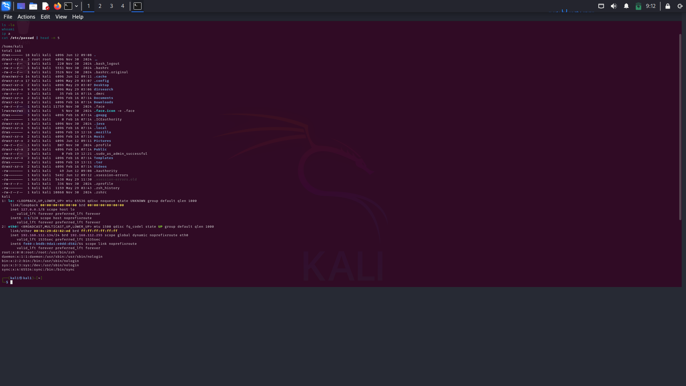
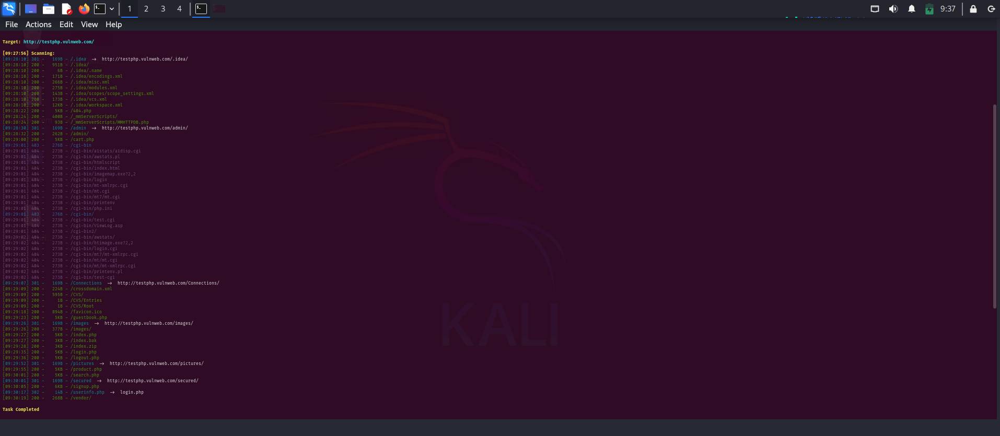
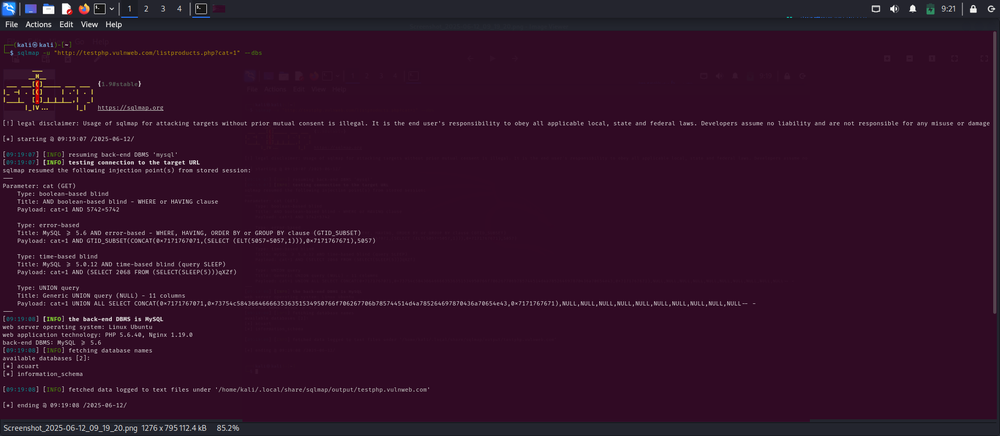
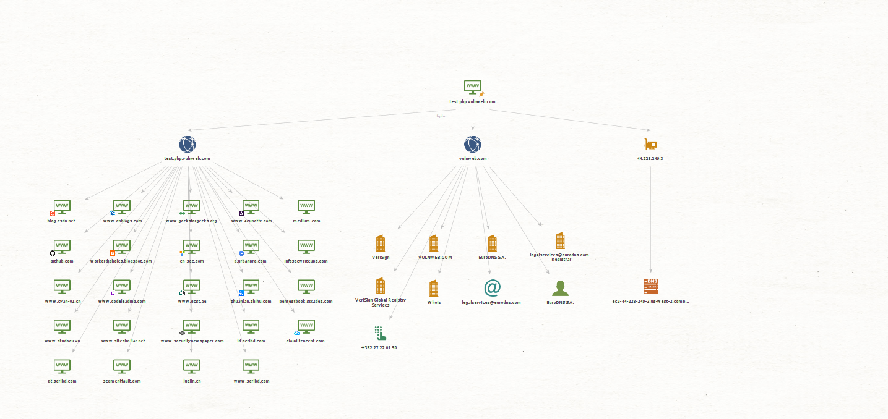
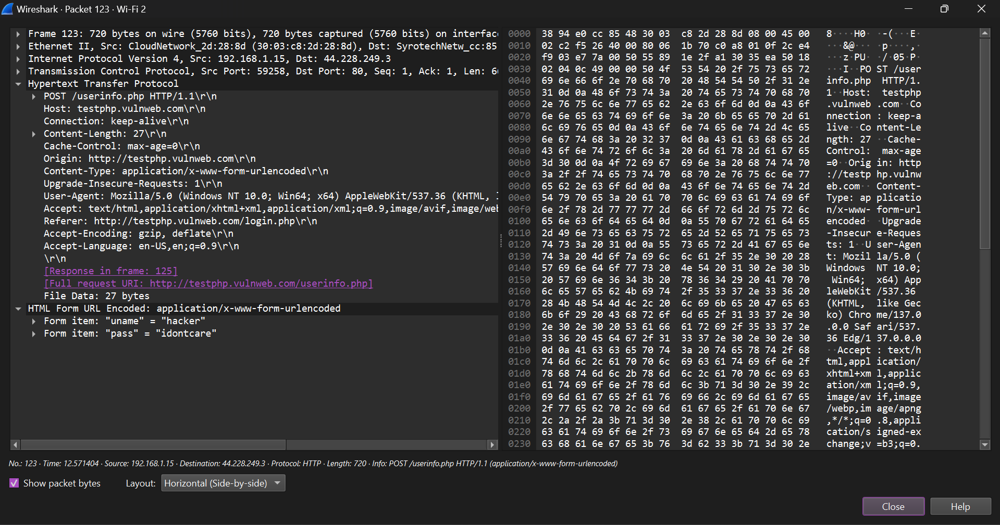

# ⚔️ Kali Linux - Hands-on (FutureIntern Cybersecurity Internship Task 1)

Hey! I'm Prajwal Sharma, currently pursuing B.Tech in Computer Science and working as a Cybersecurity Intern at FutureIntern.

This is my first hands-on project in Kali Linux where I practiced essential Linux commands, installed tools from GitHub, and executed some basic attacks ethically on the test site `http://testphp.vulnweb.com`.

---

## 🧠 What I Did:
- Practiced Linux commands (`ls`, `cat`, `ip a`, etc.)
- Installed and used tools like **SQLMap** & **Dirsearch**
- Targeted a legal vulnerable site for testing (no actual harm done)

---

## 🛠️ Tools Used:
- Kali Linux
- SQLMap
- Dirsearch
- GitHub

---

## 🔍 Commands I Practiced

```bash
# Linux Commands
pwd
ls -la
cat /etc/passwd
ip a
whoami

# SQLMap (SQL Injection)
sqlmap -u "http://testphp.vulnweb.com/listproducts.php?cat=1" --dbs

# Dirsearch (Directory brute-forcing)
git clone https://github.com/maurosoria/dirsearch.git
cd dirsearch
python3 dirsearch.py -u http://testphp.vulnweb.com/
```
## 📸 Screenshots:

### 🔹 Basic Linux Commands


### 🔹 SQLMap Output


### 🔹 Dirsearch Results



---

## 🕵️ Task 2 – Information Gathering using Maltego

In this task, I used the Maltego GUI-based OSINT tool to gather public data about the website `http://testphp.vulnweb.com`.

### 🔍 What I Did:
- Added the website node (`testphp.vulnweb.com`) to a new Maltego graph
- Ran transforms like:
  - To IP Address
  - To DNS
  - To WHOIS
  - To Netblock
- Mapped ownership, DNS, IP, and associated domains

### 🧠 Key Findings:
- IP Address: `44.228.249.3`
- Netblock: AWS server block
- Registrar: `EuroDNS S.A.`
- Email contact: `legalservices@eurodns.com`
- Connected domains: Acunetix, medium.com, geeksforgeeks.org and more

### 📸 Screenshot:


---

This helped me understand how domains can be passively mapped and ownership traced, all without touching the target.


---

## 🧪 Task 3 – Sniffing Attack using Wireshark

For this task, I used Wireshark to sniff traffic over an HTTP website (`http://testphp.vulnweb.com`) and successfully captured login credentials submitted through a form.

### 🔍 What I Did:
- Started capture on `Wi-Fi 2` interface
- Visited the test login page
- Entered dummy credentials:
  - Username: hacker
  - Password: idontcare
- Applied packet filter:
  ```bash
  http.request.method == "POST"

After applying the `POST` filter and following the TCP stream, I extracted the following:

### 📸 Captured Screenshot:


> The credentials were:
> - uname = hacker
> - pass = idontcare

---


